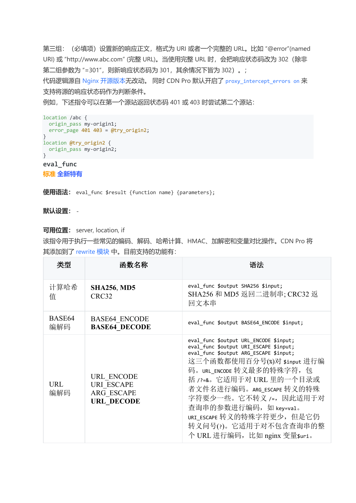
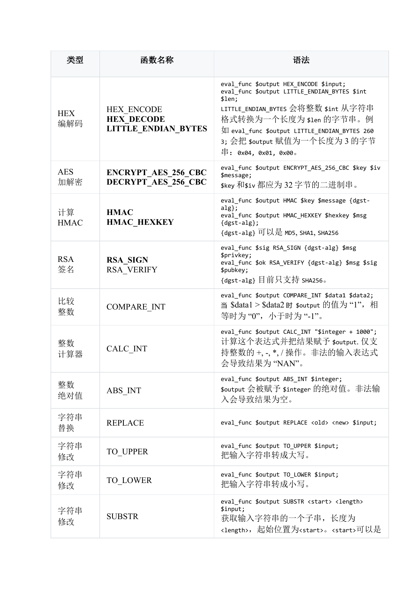
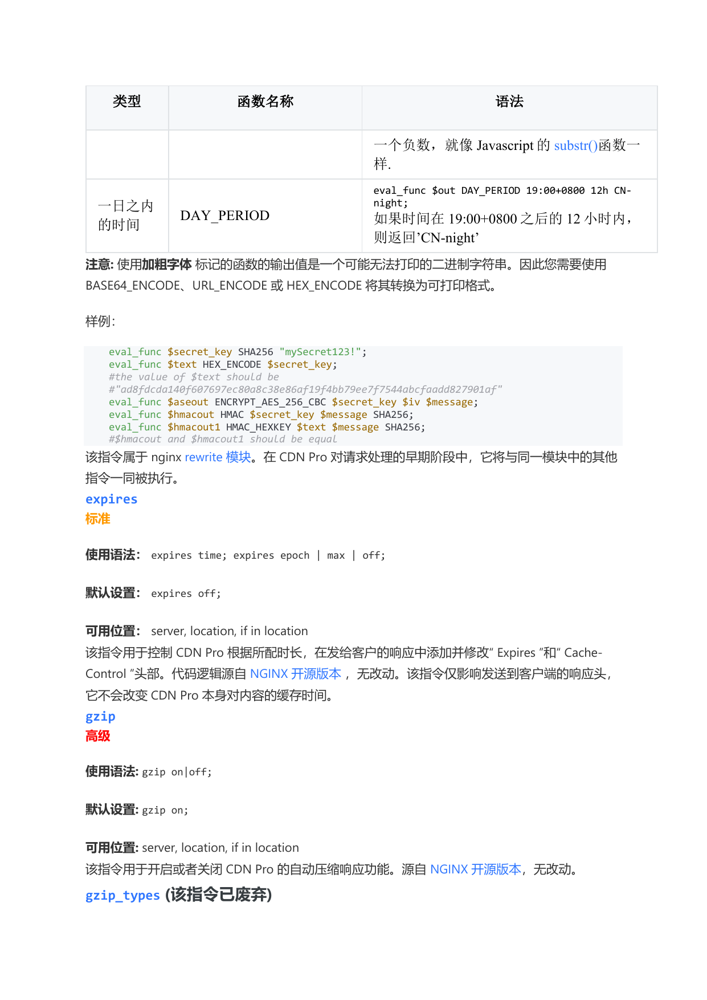

# CDN URL Presigned

> Sources:
> - Wangsu Documentation → CDN Pro → Edge Logic → Supported Directives (last updated 2025-12-17; this document focuses on the `eval_func` section).
> - Customer-supplied presigned-URL validation script.

CDN Pro performs URL presign validation through the Edge Logic `eval_func` directive: the customer signs URLs on the application side using an agreed algorithm; the CDN Pro edge re-computes the signature with the same secret and accepts the request only if it matches.

---

## Contents

- [1. URL format and example](#1-url-format-and-example)
- [2. Presign validation script (example)](#2-presign-validation-script-example)
- [3. eval_func directive reference (from official docs)](#3-eval_func-directive-reference-from-official-docs)
  - [3.1 Syntax and contexts](#31-syntax-and-contexts)
  - [3.2 Supported function table](#32-supported-function-table)
  - [3.3 Official example](#33-official-example)

---

## 1. URL format and example

```
https://files.example.com/{exp}/{sign}/{mode}/{real_path}
```

| Segment | Meaning |
| --- | --- |
| `exp` | Expiration timestamp (Unix seconds) |
| `sign` | 32-character hex signature |
| `mode` | `f` for file-level, `d` for directory-level |
| `real_path` | The actual origin path |

**Signing algorithm.** Let `SECRET` be the shared secret between the signing side and the CDN, and `exp` the expiration timestamp:

- **File-level**: `sign = HEX( MD5( SECRET + real_path + exp ) )`
- **Directory-level**: `parent` = `real_path` with the last segment stripped; `sign = HEX( MD5( SECRET + parent + exp ) )`

---

## 2. Presign validation script (example)

The customer-supplied Edge Logic script below is pasted into the property's **Edge Logic**. The hard-coded `SECRET` should be replaced with a value injected through Secrets / Vault.

```nginx
location ~ ^/(\d+)/([a-f0-9]+)/([fd])(/.+)$ {
    set $token_t $1;
    set $token_sign $2;
    set $mode $3;
    set $real_path $4;

    # Extract the parent directory
    set $parent_dir $real_path;
    if ($real_path ~ "^(.*/)[^/]+$") {
        set $parent_dir $1;
    }

    # File-level signature
    set $file_str "abwewew2757f85c51d729379fbad544a9e4wewwe2323408c7a7bb7f223ce256ddswdf9${real_path}${token_t}";
    eval_func $file_md5_bin MD5 $file_str;
    eval_func $file_sign HEX_ENCODE $file_md5_bin;

    # Directory-level signature
    set $dir_str "abwewew2757f85c51d729379fbad544a9e4wewwe2323408c7a7bb7f223ce256ddswdf9${parent_dir}${token_t}";
    eval_func $dir_md5_bin MD5 $dir_str;
    eval_func $dir_sign HEX_ENCODE $dir_md5_bin;

    # Compare against the requested mode
    set $check_f "f${file_sign}";
    set $check_d "d${dir_sign}";
    set $expect "${mode}${token_sign}";
    set $auth "0";
    if ($check_f = $expect) { set $auth "1"; }
    if ($check_d = $expect) { set $auth "1"; }
    if ($auth = "0") { return 403; }

    # Expiration check
    if ($msec ~ "^(\d+)") {
        set $now $1;
    }
    eval_func $cmp COMPARE_INT $token_t $now;
    if ($cmp ~ "^-") { return 403; }

    # Strip the signed prefix and forward to origin
    rewrite ^/\d+/[a-f0-9]+/[fd](/.+)$ $1 break;
    origin_pass myorigin;
}

location / {
    return 403;
}
```

What the script does:

1. Splits the URL into `exp` / `sign` / `mode` / `real_path` with a regex.
2. Computes both file-level and directory-level signatures using `eval_func MD5` + `HEX_ENCODE`.
3. Compares the request's `sign` against the appropriate value based on `mode`; returns 403 on mismatch.
4. Compares `exp` against `$msec` with `eval_func COMPARE_INT`; returns 403 if expired.
5. On success, strips the signed prefix via `rewrite` and forwards to `myorigin` using the actual `real_path`.
6. Any unsigned request hits `location /` and is rejected with 403.

---

## 3. eval_func directive reference (from official docs)

> Excerpted from the `eval_func` section of the **Supported Directives** document.

`eval_func` is tagged **Standard / Newly Introduced** — available to all customers and proprietary to CDN Pro.

### 3.1 Syntax and contexts

```
Syntax:   eval_func $result {function name} {parameters};
Default:  -
Contexts: server, location, if
```

The directive performs common encoding, decoding, hashing, HMAC, encryption, and integer-comparison operations. CDN Pro adds it to the **rewrite module**.



### 3.2 Supported function table

| Type | Function | Syntax & notes |
| --- | --- | --- |
| Hash | **SHA256**, **MD5**, CRC32 | `eval_func $output SHA256 $input;`<br>**SHA256** and **MD5** return a **binary string**; CRC32 returns a text string. |
| BASE64 codec | BASE64_ENCODE, **BASE64_DECODE** | `eval_func $output BASE64_ENCODE $input;` |
| URL codec | URL_ENCODE, URI_ESCAPE, ARG_ESCAPE, URL_DECODE | `eval_func $output URL_ENCODE $input;`<br>All three encoders use `%`-encoding on `$input`:<br>• **URL_ENCODE** escapes the most special characters, including `/?=&` — suitable for encoding a directory or filename inside a URL.<br>• **ARG_ESCAPE** escapes fewer specials and does **not** escape `/=` — suitable for encoding query-string parameters such as `key=val`.<br>• **URI_ESCAPE** escapes the fewest specials but still escapes `?` — suitable for encoding an entire URL without a query string, e.g. nginx's `$uri` variable. |
| HEX codec | HEX_ENCODE, **HEX_DECODE**, **LITTLE_ENDIAN_BYTES** | `eval_func $output HEX_ENCODE $input;`<br>`eval_func $output LITTLE_ENDIAN_BYTES $int $len;`<br>**LITTLE_ENDIAN_BYTES** converts integer `$int` from string form into a byte string of length `$len`. For example, `eval_func $output LITTLE_ENDIAN_BYTES 260 3;` sets `$output` to a 3-byte string `0x04, 0x01, 0x00`. |
| AES | **ENCRYPT_AES_256_CBC**, **DECRYPT_AES_256_CBC** | `eval_func $output ENCRYPT_AES_256_CBC $key $iv $message;`<br>`$key` and `$iv` must each be a 32-byte binary string. |
| HMAC | **HMAC**, **HMAC_HEXKEY** | `eval_func $output HMAC $key $message {dgst-alg};`<br>`eval_func $output HMAC_HEXKEY $hexkey $msg {dgst-alg};`<br>`{dgst-alg}` may be `MD5`, `SHA1`, or `SHA256`. |
| RSA | **RSA_SIGN**, RSA_VERIFY | `eval_func $sig RSA_SIGN {dgst-alg} $msg $privkey;`<br>`eval_func $ok RSA_VERIFY {dgst-alg} $msg $sig $pubkey;`<br>`{dgst-alg}` currently supports only `SHA256`. |
| Integer compare | COMPARE_INT | `eval_func $output COMPARE_INT $data1 $data2;`<br>`$output` is `"1"` when `$data1 > $data2`, `"0"` when equal, `"-1"` when less. |
| Integer calculator | CALC_INT | `eval_func $output CALC_INT "$integer + 1000";`<br>Evaluates the expression and assigns the result to `$output`. Supports integer `+`, `-`, `*`, `/`. An invalid expression yields `"NAN"`. |
| Integer absolute value | ABS_INT | `eval_func $output ABS_INT $integer;`<br>`$output` becomes the absolute value of `$integer`. Invalid input yields an empty result. |
| String replace | REPLACE | `eval_func $output REPLACE <old> <new> $input;` |
| String case | TO_UPPER | `eval_func $output TO_UPPER $input;` Converts the input string to upper case. |
| String case | TO_LOWER | `eval_func $output TO_LOWER $input;` Converts the input string to lower case. |
| Substring | SUBSTR | `eval_func $output SUBSTR <start> <length> $input;`<br>Returns a substring of `$input` of length `<length>` starting at position `<start>`. `<start>` may be negative, like JavaScript's `substr()`. |
| Time of day | DAY_PERIOD | `eval_func $out DAY_PERIOD 19:00+0800 12h CN-night;`<br>If the current time falls within 12 hours after `19:00+0800`, returns `'CN-night'`. |

> **Note:** Functions tagged in **bold** return a possibly non-printable binary string. Use `BASE64_ENCODE`, `URL_ENCODE`, or `HEX_ENCODE` to convert them to a printable form.



### 3.3 Official example

```nginx
eval_func $secret_key SHA256 "mySecret123!";
eval_func $text HEX_ENCODE $secret_key;
# the value of $text should be
# "ad8fdcda140f607697ec80a8c38e86af19f4bb79ee7f7544abcfaadd827901af"

eval_func $aseout ENCRYPT_AES_256_CBC $secret_key $iv $message;
eval_func $hmacout HMAC $secret_key $message SHA256;
eval_func $hmacout1 HMAC_HEXKEY $text $message SHA256;
# $hmacout and $hmacout1 should be equal
```

`eval_func` belongs to the nginx **rewrite module**. It is executed early in CDN Pro's request-processing pipeline, alongside the other directives in the same module.


