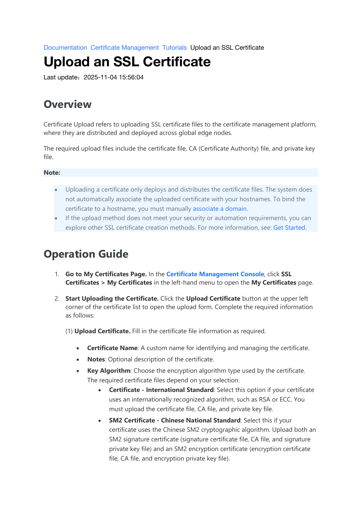
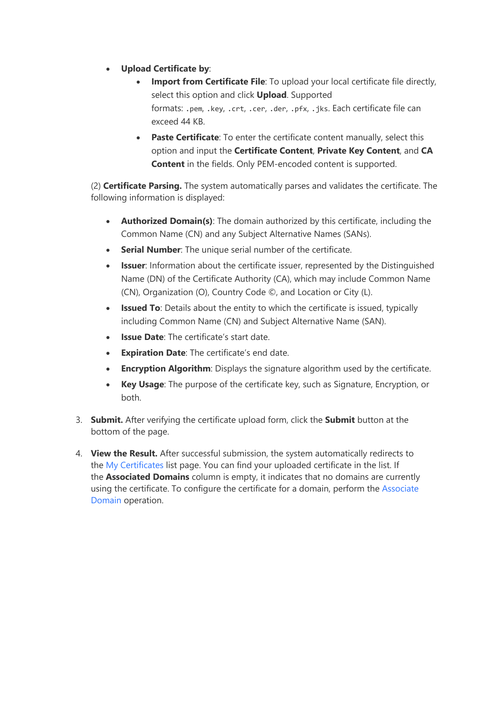

# Upload an SSL Certificate

> Source: Wangsu Documentation → Certificate Management → Tutorials → Upload an SSL Certificate (last updated 2025-11-04)

## Overview

Certificate Upload refers to uploading SSL certificate files to the certificate management platform, where they are distributed and deployed across global edge nodes.

The required upload files include the **certificate file**, **CA (Certificate Authority) file**, and **private key file**.

> **Note**
> - Uploading a certificate only deploys and distributes the certificate files. The system does not automatically associate the uploaded certificate with your hostnames. To bind the certificate to a hostname, you must manually **associate a domain**.
> - If the upload method does not meet your security or automation requirements, you can explore other SSL certificate creation methods.

---

## Operation Guide

### 1. Go to the My Certificates Page

In the **Certificate Management Console**, click **SSL Certificates → My Certificates** in the left-hand menu to open the **My Certificates** page.

### 2. Start Uploading the Certificate

Click the **Upload Certificate** button at the upper-left corner of the certificate list to open the upload form. Complete the required information as follows.

#### 2.1 Upload Certificate

Fill in the certificate file information as required.

- **Certificate Name** — A custom name for identifying and managing the certificate.
- **Notes** — Optional description of the certificate.
- **Key Algorithm** — Choose the encryption algorithm type used by the certificate. The required certificate files depend on your selection.
  - **Certificate – International Standard**: Select this option if your certificate uses an internationally recognized algorithm, such as RSA or ECC. You must upload the **certificate file**, **CA file**, and **private key file**.
  - **SM2 Certificate – Chinese National Standard**: Select this if your certificate uses the Chinese SM2 cryptographic algorithm. Upload both an **SM2 signature certificate** (signature certificate file, CA file, and signature private key file) and an **SM2 encryption certificate** (encryption certificate file, CA file, and encryption private key file).
- **Upload Certificate by**:
  - **Import from Certificate File**: To upload your local certificate file directly, select this option and click **Upload**. Supported formats: `.pem`, `.key`, `.crt`, `.cer`, `.der`, `.pfx`, `.jks`. Each certificate file cannot exceed 44 KB.
  - **Paste Certificate**: To enter the certificate content manually, select this option and input the **Certificate Content**, **Private Key Content**, and **CA Content** in the fields. Only PEM-encoded content is supported.

#### 2.2 Certificate Parsing

The system automatically parses and validates the certificate. The following information is displayed:

| Field | Description |
| --- | --- |
| **Authorized Domain(s)** | The domain authorized by this certificate, including the Common Name (CN) and any Subject Alternative Names (SANs). |
| **Serial Number** | The unique serial number of the certificate. |
| **Issuer** | Information about the certificate issuer, represented by the Distinguished Name (DN) of the Certificate Authority (CA), which may include Common Name (CN), Organization (O), Country Code (C), and Location or City (L). |
| **Issued To** | Details about the entity to which the certificate is issued, typically including Common Name (CN) and Subject Alternative Name (SAN). |
| **Issue Date** | The certificate's start date. |
| **Expiration Date** | The certificate's end date. |
| **Encryption Algorithm** | Displays the signature algorithm used by the certificate. |
| **Key Usage** | The purpose of the certificate key, such as Signature, Encryption, or both. |

### 3. Submit

After verifying the certificate upload form, click the **Submit** button at the bottom of the page.

### 4. View the Result

After successful submission, the system automatically redirects to the **My Certificates** list page. You can find your uploaded certificate in the list. If the **Associated Domains** column is empty, it indicates that no domains are currently using the certificate. To configure the certificate for a domain, perform the **Associate Domain** operation.
