# AWS S3 Bucket Acceleration

> Source: Wangsu Documentation → CDN Pro → Recipes → AWS S3 Bucket Acceleration (last updated 2026-05-28)

CDN Pro integrates with AWS S3 to deliver and cache cloud-hosted content. CDN Pro can also access **private** AWS S3 buckets. This document walks through a complete example of configuring AWS S3 bucket acceleration on both AWS and CDN Pro.

**Example scenario.** We own a domain `waytoo.digital` and want to expose an AWS S3 bucket on the subdomain `files.waytoo.digital` so that users can fetch files from the bucket through that subdomain. The walkthrough covers public-bucket access first, then private-bucket access.

**Contents**

- [Step 1: Create and configure a public AWS S3 bucket](#step-1-create-and-configure-a-public-aws-s3-bucket)
- [Step 2: Create and configure a CDN Pro property](#step-2-create-and-configure-a-cdn-pro-property)
  - [2.1 Configure the edge hostname](#21-configure-the-edge-hostname)
  - [2.2 Configure the certificate](#22-configure-the-certificate)
  - [2.3 Configure the property](#23-configure-the-property)
  - [2.4 Test in staging](#24-test-in-staging)
  - [2.5 Deploy to production](#25-deploy-to-production)
  - [2.6 Test in production](#26-test-in-production)
- [Step 3: Access a private bucket](#step-3-access-a-private-bucket)
  - [3.1 Set the Amazon S3 bucket to private](#31-set-the-amazon-s3-bucket-to-private)
  - [3.2 Enable origin authentication on CDN Pro](#32-enable-origin-authentication-on-cdn-pro)

---

## Step 1: Create and configure a public AWS S3 bucket

1. Sign in to the AWS S3 console and create a new bucket.

   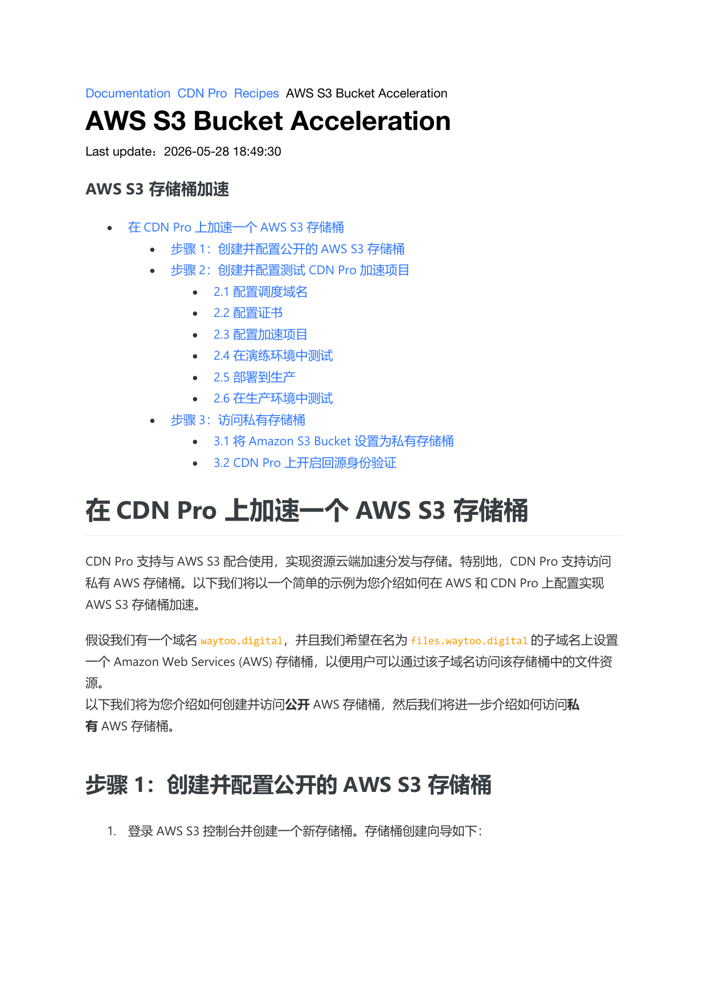

2. Enter the bucket name (a valid DNS prefix): `files-waytoo-digital`.

3. Click **Next**.

4. Skip **Configure options**.

5. Leave **Block all public access** selected by default.
   > AWS defaults to a private bucket; you can switch it to public after creation. AWS will not let you proceed (**Next**) otherwise.

6. Click **Next** → **Save**. The bucket is created.

7. Configure access control on the new bucket. The **Permissions** panel:

   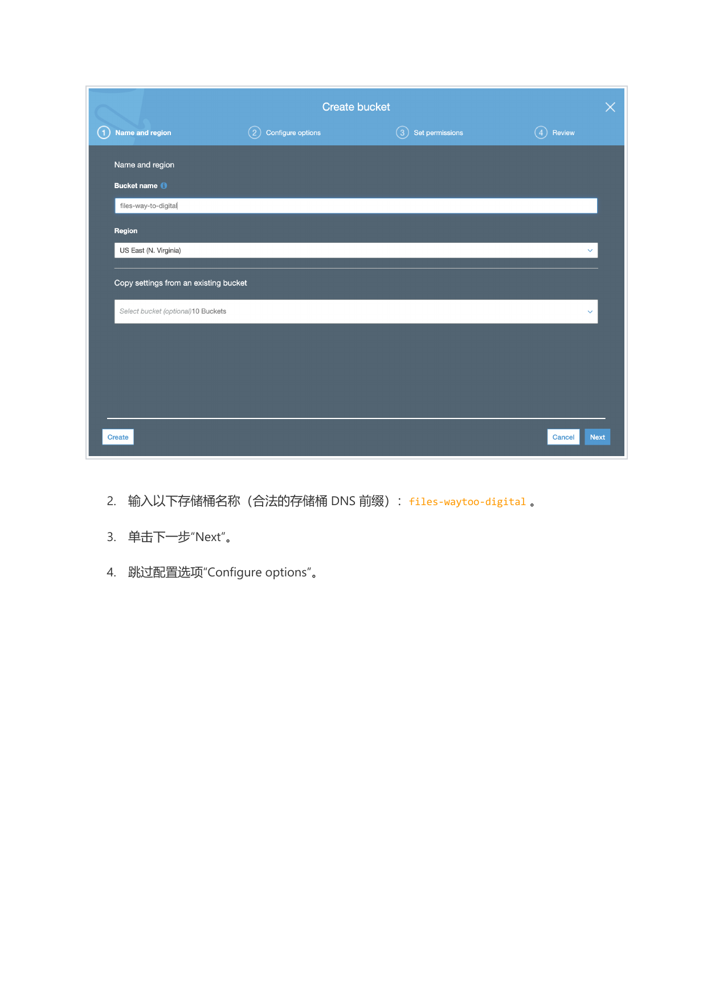

8. Uncheck **Block all public access**, then click **Save**.

9. Copy the following CORS configuration and paste it into the **CORS configuration** editor:

   ```xml
   <?xml version="1.0" encoding="UTF-8"?>
   <CORSConfiguration xmlns="http://s3.amazonaws.com/doc/2006-03-01/">
   <CORSRule>
       <AllowedOrigin>*</AllowedOrigin>
       <AllowedMethod>GET</AllowedMethod>
       <MaxAgeSeconds>3000</MaxAgeSeconds>
       <AllowedHeader>Authorization</AllowedHeader>
   </CORSRule>
   </CORSConfiguration>
   ```

10. Upload a file to the bucket to test the configuration and grant read/write permissions to the uploaded object.

    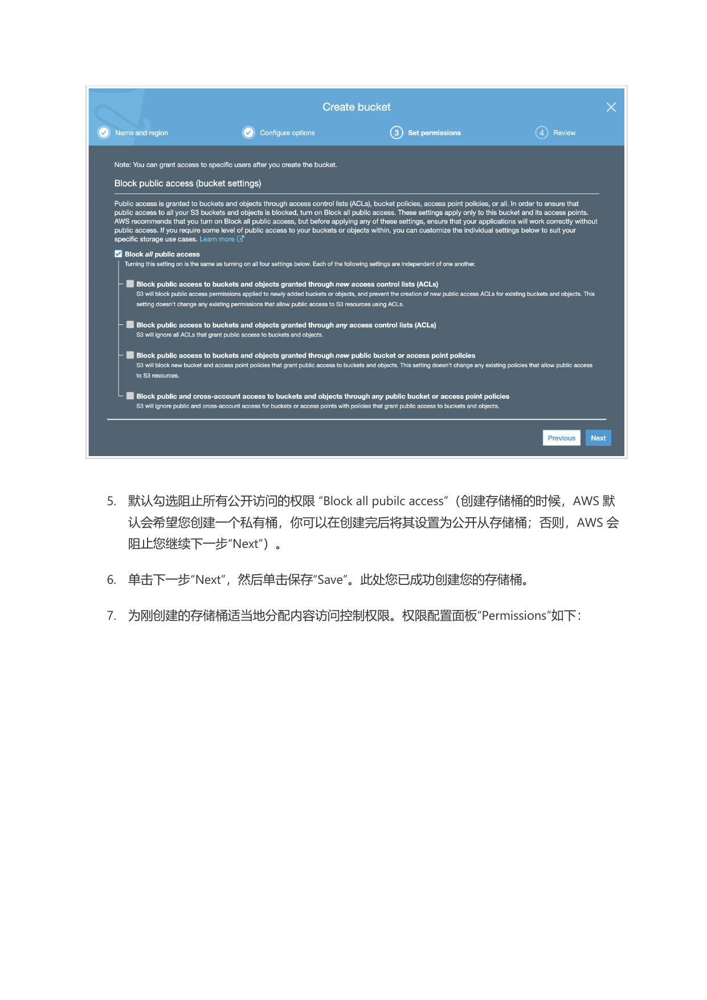

11. Click the uploaded file in the bucket to view the **Object URL**.

    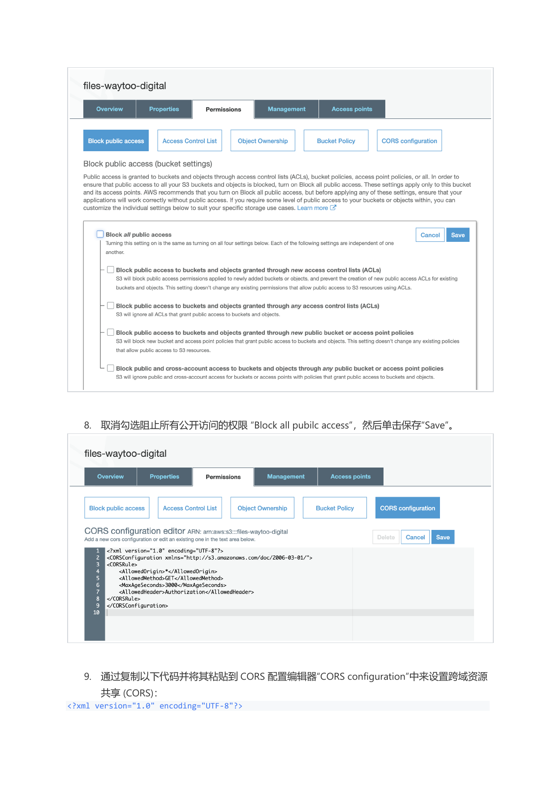

    Amazon S3 generates the file URL automatically. In this example the URL is
    `https://files-waytoo-digital.s3.amazonaws.com/file_1m.bin`.
    The Amazon S3 file access hostname is normally formatted as `<BUCKET_NAME>.<REGION>.amazonaws.com`; in this example Amazon S3 returned `s3` instead of a region. Either way, this bucket hostname is what we will use as the CDN Pro origin: `files-waytoo-digital.s3.amazonaws.com`.

---

## Step 2: Create and configure a CDN Pro property

Sign in to the CDN Pro console and follow the Quick Start guide to create and validate a test property.

### 2.1 Configure the edge hostname

1. On the edge hostname page, create an edge hostname `files-waytoo-digital.qtlcdn.com`.

   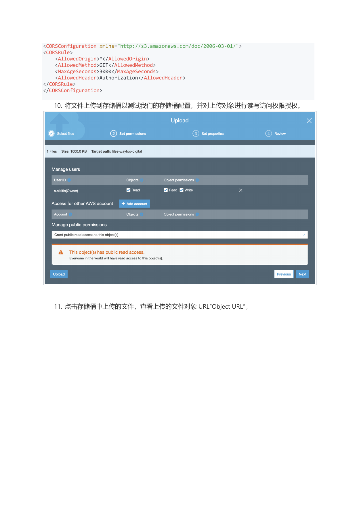

2. After creation, verify it resolves from your terminal:

   ```
   $ ping files-waytoo-digital.qtlcdn.com
   PING files-waytoo-digital.qtlcdn.com (14.0.119.186): 56 data bytes
   64 bytes from 14.0.119.186: icmp_seq=0 ttl=56 time=3.775 ms
   64 bytes from 14.0.119.186: icmp_seq=1 ttl=56 time=3.953 ms
   64 bytes from 14.0.119.186: icmp_seq=2 ttl=56 time=3.739 ms
   64 bytes from 14.0.119.186: icmp_seq=3 ttl=56 time=4.733 ms
   ```

### 2.2 Configure the certificate

1. **Create the certificate.** On the certificate page, click **New Certificate** and create a certificate that auto-renews via Let's Encrypt:
   1. Fill in **Certificate Name** and **Certificate Description**.
   2. Set **Auto Renewal** to **Let's Encrypt**, **Creation Method** to **Auto Generate**, and **Public Key Algorithm** to **RSA2048**. Enter `files.waytoo.digital` in both **Authorized Domain** and **SAN**.
   3. Click **Save** to create the certificate.

   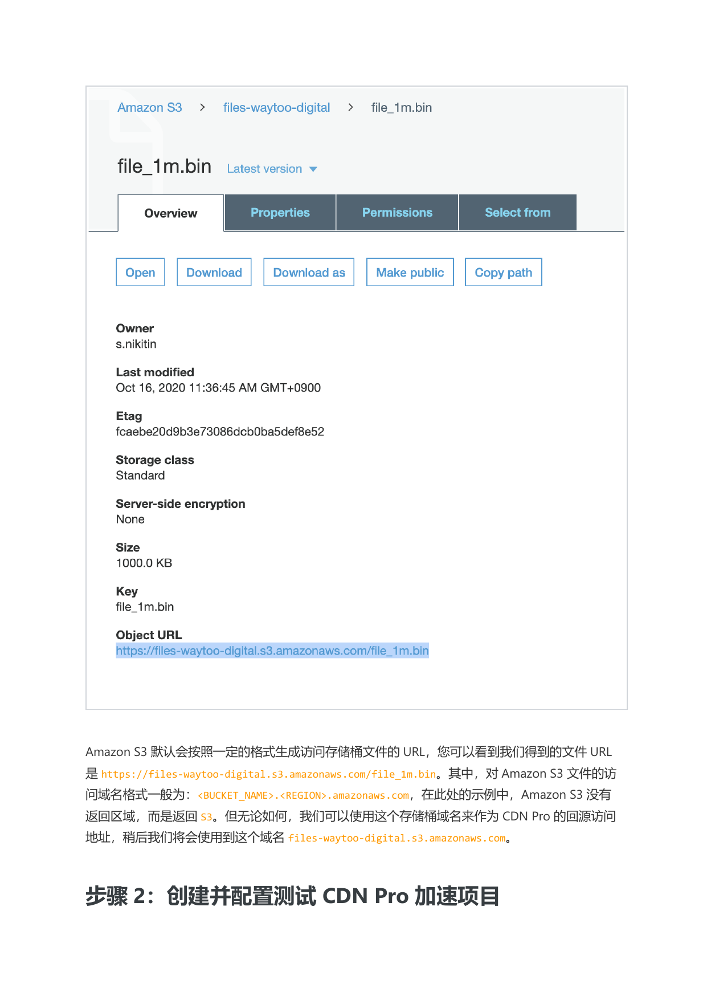

2. **Deploy the certificate to staging.** Once created, deploy it to staging first to validate before publishing to production.

   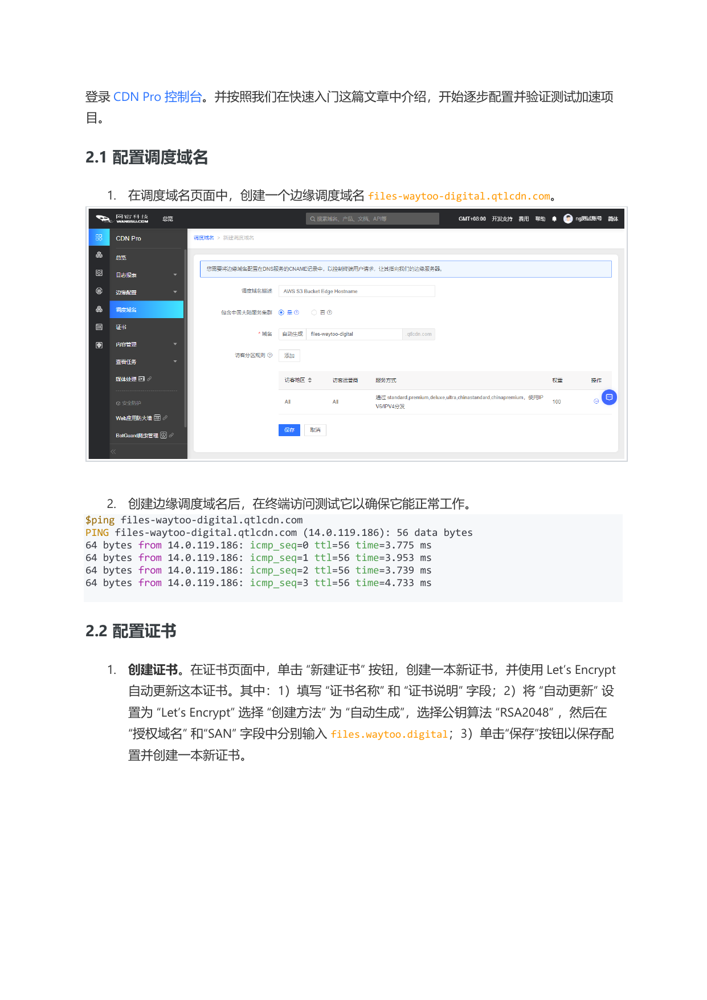

### 2.3 Configure the property

1. **Create a property.** On the properties page, click **New Property**:
   1. Enter **Property Name**, **Property Description**, and **Service Type**.
   2. Enter at least one hostname under **Accelerated Domain**. CDN Pro extracts the Host header from client requests and matches it against this domain to apply the property's configuration.

   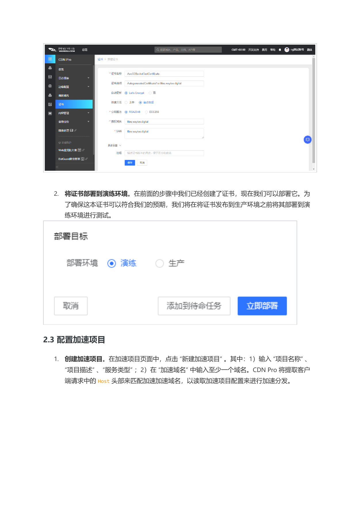

2. **Add the Amazon S3 bucket as an origin.** Under **Origin**, click **Add**:
   1. **Origin Name**: set to `aws_origin`; this name will be referenced in Edge Logic later.
   2. **Hostname / IP Address**: `files-waytoo-digital.s3.amazonaws.com`. Click **Verify** to check origin reachability.
   3. **Host Header**: expand **Advanced Configuration** and set **Host Header** to `files-waytoo-digital.s3.amazonaws.com`.
   4. Click **Save** to create the Amazon S3 origin.

   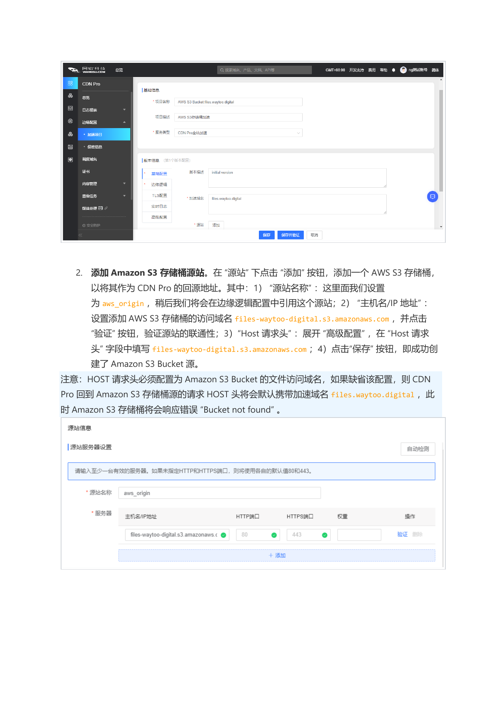

   > **Note:** The Host header **must** be set to the Amazon S3 bucket's file access hostname. If left blank, CDN Pro will forward the request to Amazon S3 with the accelerated domain `files.waytoo.digital` in the Host header by default, and Amazon S3 will respond with **Bucket not found**.

3. **Configure Edge Logic.** On the Edge Logic page, click **Default Cache Template** and import the "site-wide acceleration" baseline:
   1. Set the origin for every path in the cache template to `aws_origin`.
   2. In the path-specific cache rules, enable "force ignore origin response headers" to control caching at CDN Pro.
   3. Click **OK** to import. The Edge Logic editor will show the generated script (you can adjust it to match your business needs).

   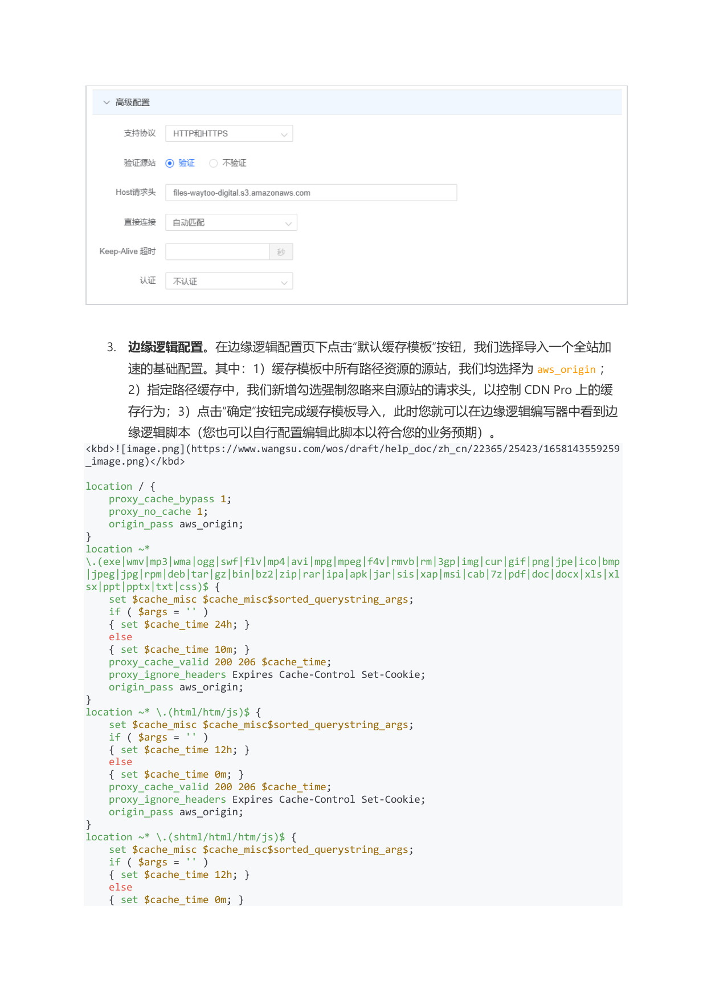

   ```nginx
   location / {
       proxy_cache_bypass 1;
       proxy_no_cache 1;
       origin_pass aws_origin;
   }
   location ~* \.(exe|wmv|mp3|wma|ogg|swf|flv|mp4|avi|mpg|mpeg|f4v|rmvb|rm|3gp|img|cur|gif|png|jpe|ico|bmp|jpeg|jpg|rpm|deb|tar|gz|bin|bz2|zip|rar|ipa|apk|jar|sis|xap|msi|cab|7z|pdf|doc|docx|xls|xlsx|ppt|pptx|txt|css)$ {
       set $cache_misc $cache_misc$sorted_querystring_args;
       if ( $args = '' )
       { set $cache_time 24h; }
       else
       { set $cache_time 10m; }
       proxy_cache_valid 200 206 $cache_time;
       proxy_ignore_headers Expires Cache-Control Set-Cookie;
       origin_pass aws_origin;
   }
   location ~* \.(html/htm/js)$ {
       set $cache_misc $cache_misc$sorted_querystring_args;
       if ( $args = '' )
       { set $cache_time 12h; }
       else
       { set $cache_time 0m; }
       proxy_cache_valid 200 206 $cache_time;
       proxy_ignore_headers Expires Cache-Control Set-Cookie;
       origin_pass aws_origin;
   }
   location ~* \.(shtml/html/htm/js)$ {
       set $cache_misc $cache_misc$sorted_querystring_args;
       if ( $args = '' )
       { set $cache_time 12h; }
       else
       { set $cache_time 0m; }
       proxy_cache_valid 200 206 $cache_time;
       proxy_ignore_headers Expires Cache-Control Set-Cookie;
       origin_pass aws_origin;
   }
   ```

4. **Bind a TLS certificate to the property.** To support HTTPS delivery, configure a TLS certificate for the property. On the TLS configuration page, click the **TLS Certificate** field and select the certificate you just created and deployed to staging.

   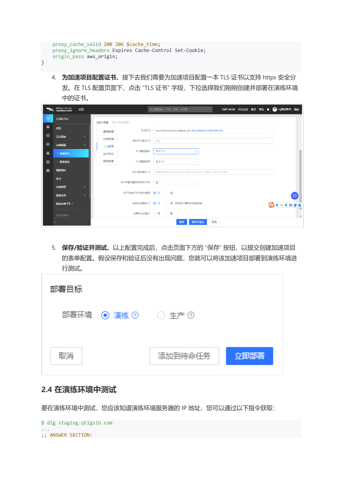

5. **Save / validate / test.** Click **Save** at the bottom to submit the property configuration. If save and validation succeed, deploy the property to staging for testing.

   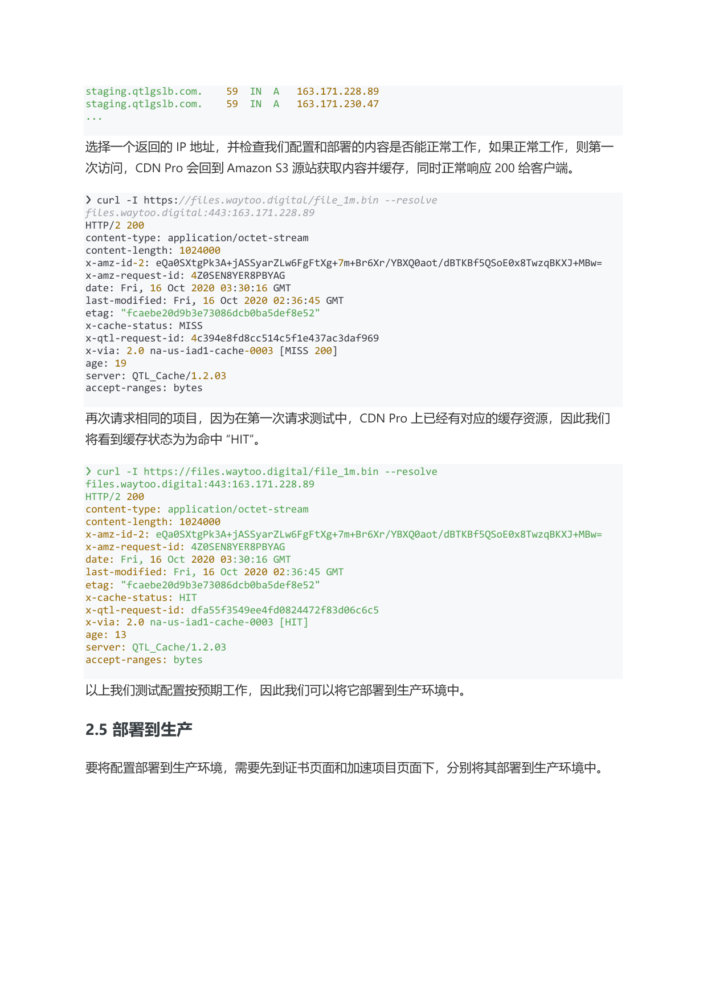

### 2.4 Test in staging

To test in staging, first obtain the staging server IP:

```
$ dig staging.qtlgslb.com
...
;; ANSWER SECTION:
staging.qtlgslb.com.   59   IN   A   163.171.228.89
staging.qtlgslb.com.   59   IN   A   163.171.230.47
...
```

Pick one of the returned IPs and verify the configuration. On the first request CDN Pro fetches content from Amazon S3, caches it, and responds with 200:

```
❯ curl -I https://files.waytoo.digital/file_1m.bin --resolve files.waytoo.digital:443:163.171.228.89
HTTP/2 200
content-type: application/octet-stream
content-length: 1024000
x-amz-id-2: eQa0SXtgPk3A+jASSyarZLw6FgFtXg+7m+Br6Xr/YBXQ0aot/dBTKBf5QSoE0x8TwzqBKXJ+MBw=
x-amz-request-id: 4Z0SEN8YER8PBYAG
date: Fri, 16 Oct 2020 03:30:16 GMT
last-modified: Fri, 16 Oct 2020 02:36:45 GMT
etag: "fcaebe20d9b3e73086dcb0ba5def8e52"
x-cache-status: MISS
x-qtl-request-id: 4c394e8fd8cc514c5f1e437ac3daf969
x-via: 2.0 na-us-iad1-cache-0003 [MISS 200]
age: 19
server: QTL_Cache/1.2.03
accept-ranges: bytes
```

Repeat the request — CDN Pro now serves it from cache, with `x-cache-status: HIT`:

```
❯ curl -I https://files.waytoo.digital/file_1m.bin --resolve files.waytoo.digital:443:163.171.228.89
HTTP/2 200
...
x-cache-status: HIT
...
```

Once the staging configuration works as expected, proceed to production.

### 2.5 Deploy to production

To roll out, deploy the certificate and the property to production from their respective pages.

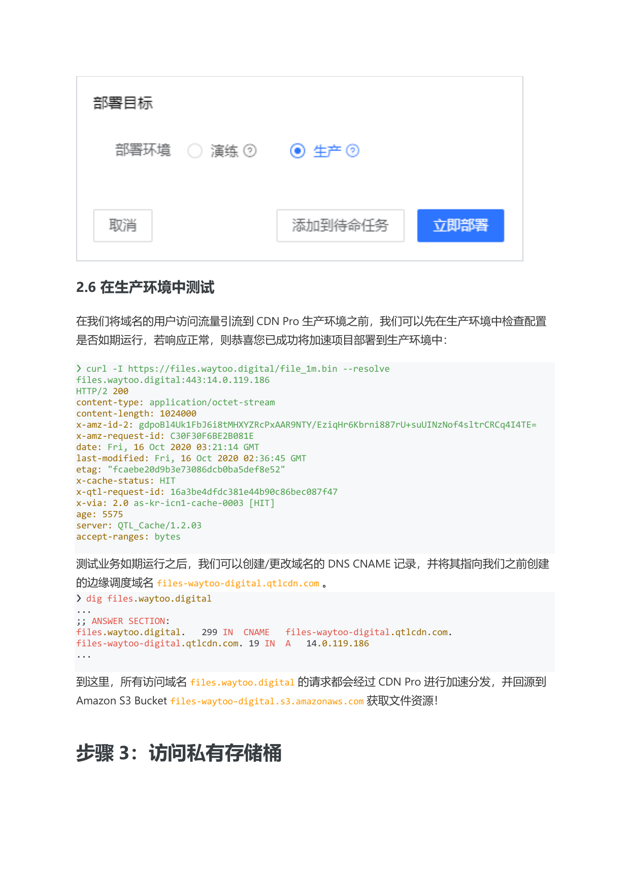

### 2.6 Test in production

Before cutting DNS over, validate the configuration directly against the production edge IPs. A successful response confirms the deployment:

```
❯ curl -I https://files.waytoo.digital/file_1m.bin --resolve files.waytoo.digital:443:14.0.119.186
HTTP/2 200
content-type: application/octet-stream
content-length: 1024000
...
x-cache-status: HIT
x-via: 2.0 as-kr-icn1-cache-0003 [HIT]
...
```

Once the business validates production, create or update the domain's DNS CNAME to point to the edge hostname `files-waytoo-digital.qtlcdn.com`:

```
❯ dig files.waytoo.digital
...
;; ANSWER SECTION:
files.waytoo.digital.            299 IN CNAME  files-waytoo-digital.qtlcdn.com.
files-waytoo-digital.qtlcdn.com.  19 IN A      14.0.119.186
...
```

All requests to `files.waytoo.digital` now flow through CDN Pro and origin back to the Amazon S3 bucket `files-waytoo-digital.s3.amazonaws.com`.

---

## Step 3: Access a private bucket

We have a public bucket accelerated through CDN Pro. Now let's switch the bucket to private and authorize CDN Pro to access it.

### 3.1 Set the Amazon S3 bucket to private

Return to the AWS S3 bucket configuration. On the **Permissions** tab, re-check **Block all public access** to make the bucket private. Once private, fetching content from the bucket requires a credential; AWS S3 will only return objects after authenticating the request.

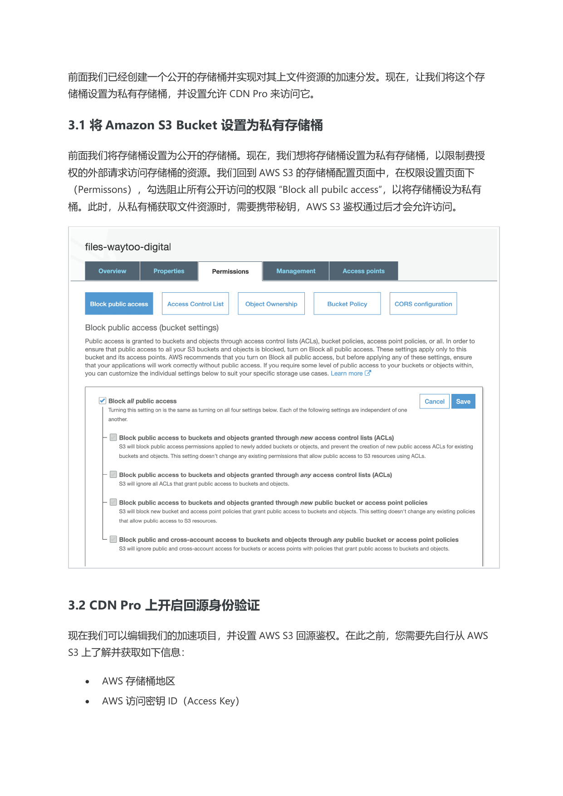

### 3.2 Enable origin authentication on CDN Pro

Edit the property to enable AWS S3 origin authentication. Before doing so, gather the following from AWS S3:

- **AWS bucket region**
- **AWS Access Key ID**
- **AWS Secret Access Key**

1. On the properties page, select the property you created earlier and **clone a new version** of it.
2. Edit the new version and modify the `aws_origin` you previously configured.
3. In the origin's **Advanced Configuration**, enable AWS S3 origin authentication:
   1. **Authentication**: select **AWS S3**.
   2. **Region**: select the region where the AWS S3 bucket lives.
   3. **Access Key**: enter the AWS S3 Access Key ID.
   4. **Secret Key**: select the **Secret** entry that stores the encrypted Secret Access Key.

   Click **Save**.

   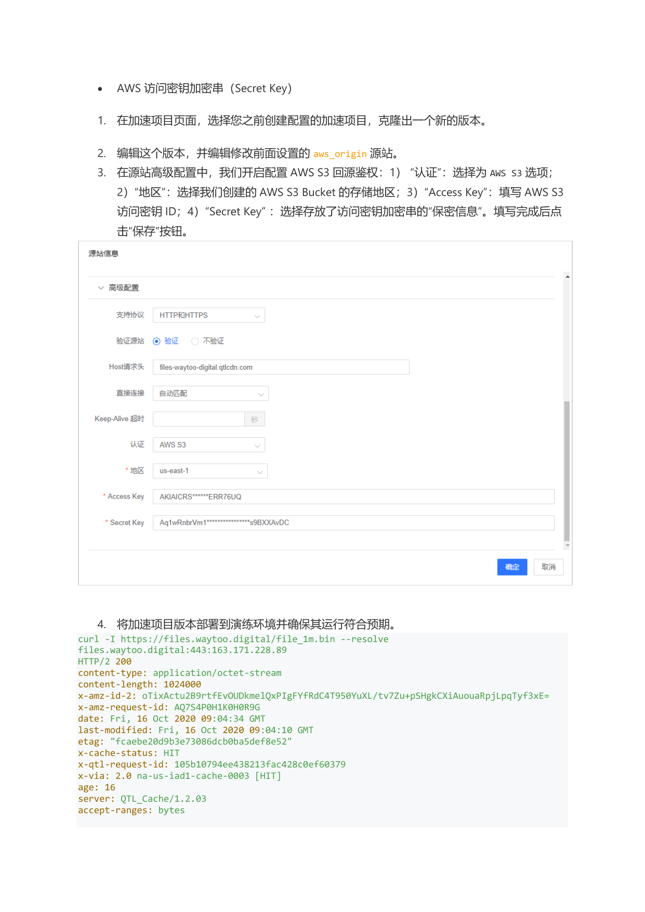

4. Deploy the new property version to staging and validate it works as expected:

   ```
   curl -I https://files.waytoo.digital/file_1m.bin --resolve files.waytoo.digital:443:163.171.228.89
   HTTP/2 200
   ...
   x-cache-status: HIT
   ...
   ```

5. Deploy to production.

   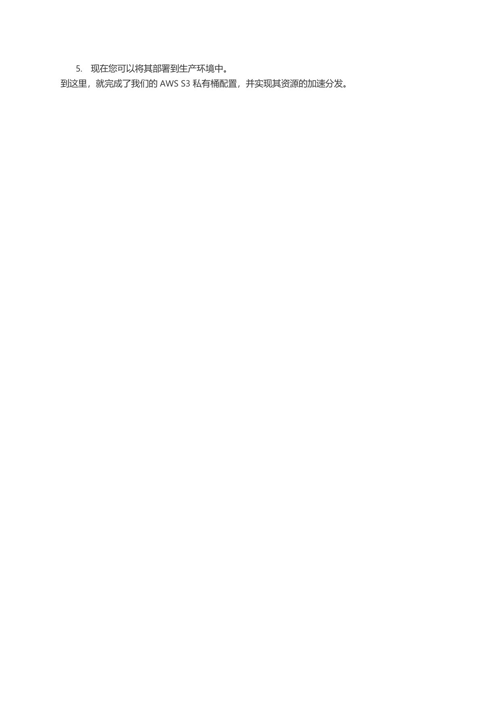

The AWS S3 private-bucket configuration is now complete and the bucket's content is being accelerated through CDN Pro.
